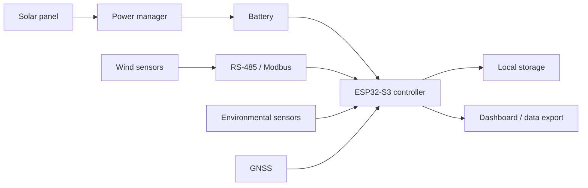

# Solar Weather Station

> An open-source, solar-powered ESP32-S3 weather station for local microclimate monitoring and engineering education.

**Learn from existing engineering → Rebuild → Adapt → Validate → Open-source → Teach forward.**

This repository is a real engineering project used as one live exemplar for [ENGG2202 - Green Technology](https://github.com/heqihao522828-crypto/ENGG2202-Green-Technology). The separate course repository explains the Green Technology journey, active-learning process and reusable student framework. This repository shows what that framework looks like when applied to one incomplete project.

It records not only the proposed solution, but also the green problem/baseline, alternatives considered, open-reference learning, design decisions, budget, materials, prototypes, failures, tests and reflections. Students may study and replace the method with their own Green Technology problem; they are not expected to copy this topic or solution.

> [中文 GitHub 导览：每个页面和文件为什么存在](docs/GITHUB-GUIDE-ZH.md)

> [Course–exemplar synchronisation record](teaching/COURSE-SYNC.md): when the project changes, check whether the ENGG2202 teaching example must change too—and vice versa.

## Why this project?

Regional weather data does not always represent the microclimate where an engineering decision is made. The instructor interview confirms the first use as a `go / conditional go / no-go` decision for a supervised 72-hour first field validation of a student environmental-monitoring prototype. A real TA interview has defined the workflow needs, while the supervised dry run, exact point near HKU's Tam Wing Fan Innovation Wing One, permission, reference access and thresholds still require validation.

## Intended capabilities

- Wind speed and wind direction
- Temperature, humidity, and pressure
- UV or related environmental sensing (sensor selection pending)
- GNSS time and location
- Solar and battery operation
- Local data logging and a web dashboard
- RS-485 / Modbus connections for robust outdoor sensors

These are design targets, not claims that every subsystem has been validated.

## System architecture

The diagram is deliberately high-level. Pin assignments, electrical interfaces, protocols, and verified limits belong in the subsystem documentation rather than being implied by this overview.

## Current status

| Area | Status | Evidence needed next |
|---|---|---|
| Problem and project foundation | [Original v0.1 PDF imported](docs/source-documents/Solar_Weather_Station_Project_Foundation_v0.1.pdf) | Maintain traceability as the living documents evolve |
| Solution landscape | First comparison plus Gate A instructor and Gate B [TA interviews](docs/project-journey/stakeholder-validation-record.md) completed; Gate C [site pack and clearly labelled synthetic teaching example](tests/site-validation-pack/README.md) prepared | For real deployment, replace the simulation with responsible-staff site evidence; also complete the TA dry run, reference/quotation, tabletop and stakeholder re-scoring before concept lock |
| Reference-project lineage | Exact project links and observed licences recorded | Lock immutable commits before any file reuse |
| ESP32-S3 architecture | Proposed | Add wiring, firmware, and bench-test evidence |
| Environmental sensor | Pending decision | Selection matrix and calibration plan |
| Power subsystem | Proposed | Measured load profile and solar energy budget |
| Outdoor enclosure | In development | CAD, assembly guide, and ingress-risk review |
| 72-hour outdoor validation | Not started | Time-stamped dataset and test report |

## Project journey

The engineering narrative is split into reviewable steps:

1. [Problem identification](docs/project-journey/01-problem.md)
2. [Existing-solution landscape](docs/project-journey/02-solution-landscape.md)
3. [Reference projects](docs/project-journey/03-reference-projects.md)
4. [Design requirements](docs/project-journey/04-design-requirements.md)
5. [Design decisions](docs/project-journey/05-design-decisions.md)
6. [Budget and procurement](docs/project-journey/06-budget.md)
7. [Prototyping](docs/project-journey/07-prototyping.md)
8. [Testing and validation](docs/project-journey/08-testing.md)
9. [Reflection and teaching transfer](docs/project-journey/09-reflection.md)

## Repository map

| Folder/file | What it is for |
|---|---|
| `README.md` | The project’s front door: purpose, status, architecture, and navigation |
| `docs/project-journey/` | The traceable engineering process behind the final design |
| `hardware/` | Schematics, wiring, PCB, interfaces, and electrical evidence |
| `mechanical/` | CAD, drawings, enclosure, mounting, and fabrication guidance |
| `firmware/esp32s3/` | Embedded source code, configuration, and flashing instructions |
| `dashboard/` | Data model, visualisation, and deployment instructions |
| `bom/` | Bill of materials, suppliers, cost, and procurement status |
| `tests/` | Test plans, raw evidence, acceptance criteria, and results |
| `teaching/` | How this project maps to ENGG2202 learning and assessment |
| `.github/` | Contribution templates used by GitHub Issues and Pull Requests |

## Quick start

The build is not reproducible yet. The eventual pathway will be:

1. Review the requirements and safety constraints.
2. Purchase the locked BOM revision.
3. Fabricate the enclosure and mounting parts.
4. Assemble and inspect the electrical system.
5. Configure and flash the firmware.
6. Run subsystem diagnostics.
7. Complete the validation matrix before field deployment.

Until those instructions and tests are complete, treat this repository as a **work-in-progress engineering record**, not a finished consumer product.

## Budget framework

| Build level | Early planning range (USD) | Purpose |
|---|---:|---|
| Bench prototype | 100–180 | Sensor and communications learning |
| Outdoor prototype | 180–300 | Integrated solar-powered field prototype |
| Ruggedised build | 300–450+ | Improved mounting, protection, and reliability |

These ranges must be replaced or supported by quotations in [`bom/bom.csv`](bom/bom.csv).

## Project baselines

- [Solar Weather Station Project Foundation v0.1](docs/source-documents/Solar_Weather_Station_Project_Foundation_v0.1.pdf) - immutable 26-page engineering baseline dated 14 August 2026.
- [Foundation traceability record](docs/source-documents/FOUNDATION-TRACEABILITY.md) - maps source sections and claims into the living repository.
- The ENGG2202 course template is retained under `teaching/source-documents/` as an internal course-design reference. Review its distribution status before making this repository public.

## Contributing

Ideas, test results, sensor comparisons, documentation improvements, and design reviews are welcome. Please read [CONTRIBUTING.md](CONTRIBUTING.md) and open an Issue before making a major design change.

## Licensing and attribution

The final licence has not yet been selected because third-party firmware and hardware-design lineage must be audited first. See [THIRD_PARTY.md](THIRD_PARTY.md) and [LICENSES/README.md](LICENSES/README.md). Do not copy external code or design files into this repository until their licence and attribution requirements are recorded.

## Safety

Outdoor electrical systems, rechargeable batteries, fabrication tools, and elevated mounting introduce real hazards. Risk assessment, supervision, weather protection, strain relief, fusing, and appropriate test procedures are required. This repository does not replace professional engineering judgement.
