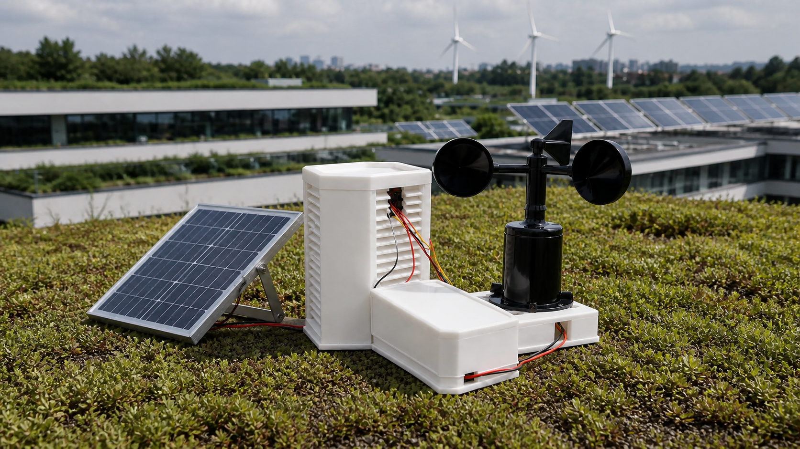
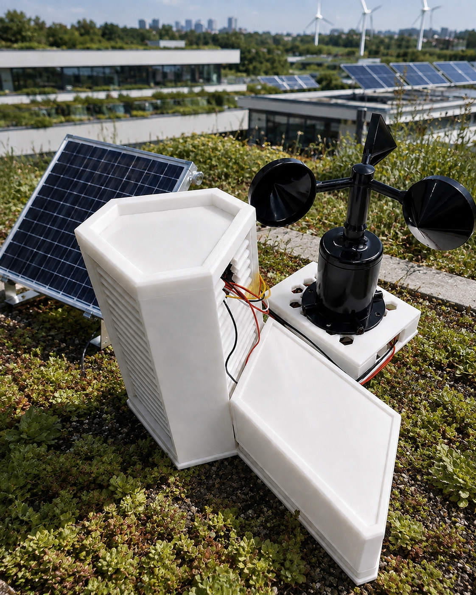
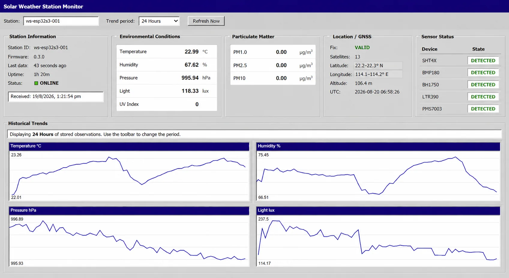
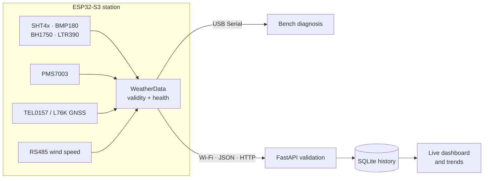
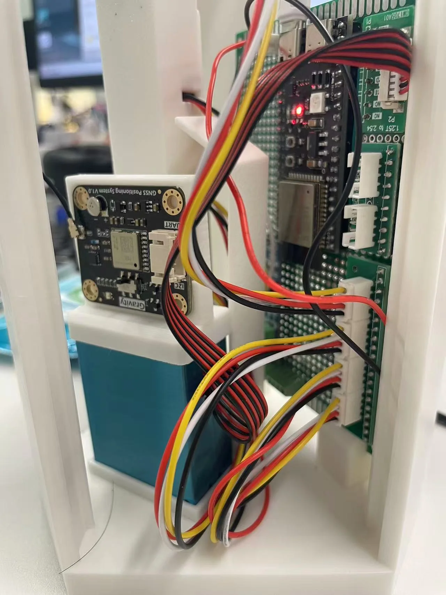
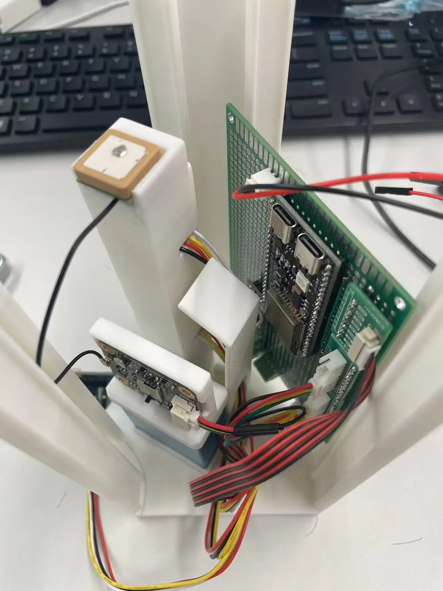
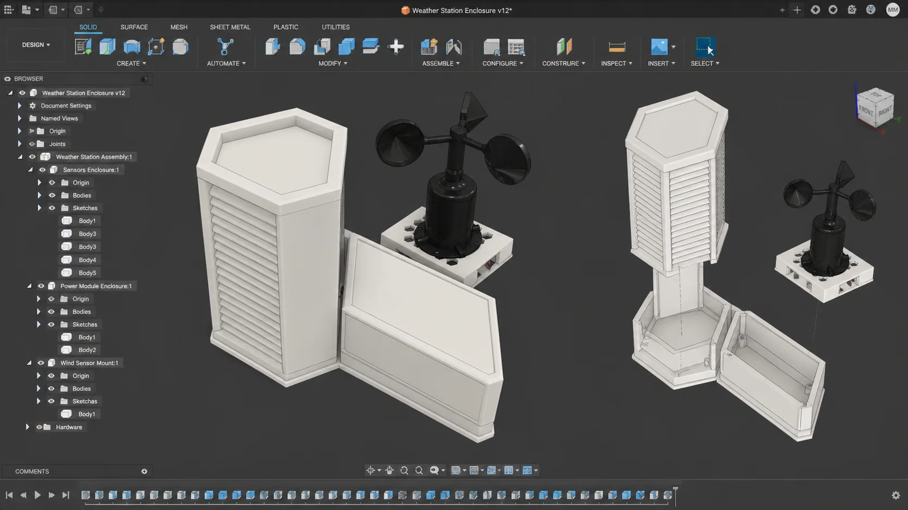
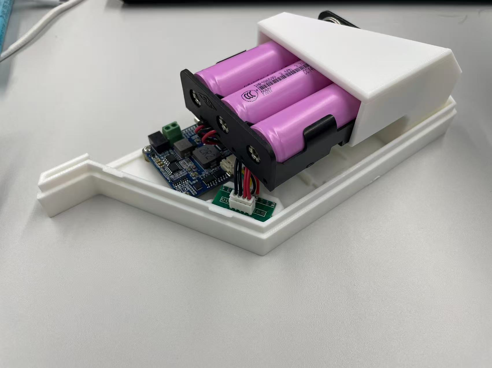
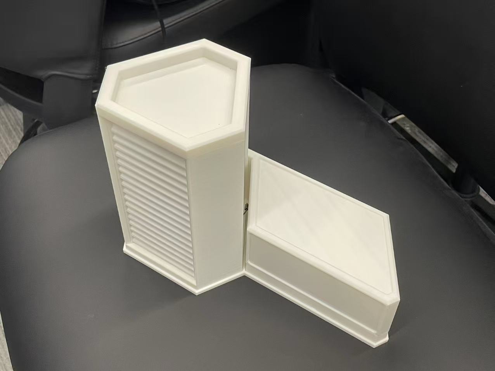

# Solar Weather Station

<p align="center">
  
</p>

<p align="center">
  <strong>Make invisible microclimates visible—so greener campus decisions can be based on local evidence.</strong>
</p>

<p align="center">
  A solar-powered station for investigating how heat, light, particles and wind vary across the places where people study, work and grow plants.
</p>

<p align="center">
  <a href="https://github.com/heqihao522828-crypto/solar-weather-station/actions/workflows/ci.yml"></a>
  
  
  
  <a href="LICENSE"></a>
</p>

<p align="center"><sub>Application visualisation based on the completed prototype. Field performance still requires the tests described in this repository.</sub></p>

## The problem: one forecast cannot describe every place

A city-wide forecast can tell us the general weather, but it cannot describe every rooftop garden, shaded courtyard, workshop entrance or sun-heated wall. Two places only a short walk apart may experience different temperature, light, particles and wind. Without local evidence, decisions about shade, planting, ventilation, outdoor activities and equipment placement can easily be based on assumption.

That creates a more interesting engineering question than simply displaying sensor values:

> **Can a repairable, solar-powered station produce trustworthy local evidence for deciding where and when a campus space needs environmental improvement?**

The Solar Weather Station grew from that question. It is designed to compare conditions between small campus locations and over time, while keeping sensor failures and uncertainty visible. A useful outcome is not simply a dashboard: it is evidence that can support a specific decision, such as whether a rooftop growing area needs shade, whether a courtyard needs further heat investigation, or whether a proposed monitoring location is representative.

The aim is not to imitate a certified meteorological station or claim that one prototype solves urban climate change. The aim is to create an honest local evidence tool—one verified subsystem and one decision at a time.

## Green Technology and the SDGs

<table>
  <tr>
    <td align="center" width="33%">
      <br>
      <strong>SDG 7 · Affordable and Clean Energy</strong><br>
      <sub>The station tests whether local monitoring can run from a measured solar-energy budget. Power demand, charging loss and endurance are recorded before autonomy is claimed.</sub>
    </td>
    <td align="center" width="33%">
      <br>
      <strong>SDG 9 · Industry, Innovation and Infrastructure</strong><br>
      <sub>Editable CAD, modular firmware and an open data path make the monitoring infrastructure repairable, reproducible and adaptable to another site.</sub>
    </td>
    <td align="center" width="33%">
      <br>
      <strong>SDG 13 · Climate Action</strong><br>
      <sub>Hyperlocal observations can reveal heat, exposure and weather patterns that inform a campus adaptation decision. Impact begins only when the evidence changes an action.</sub>
    </td>
  </tr>
</table>

Together, the three goals form one testable chain: **power the sensing responsibly (SDG 7), leave behind reusable monitoring infrastructure (SDG 9), and use its evidence to inform local climate adaptation (SDG 13).** Sustainability still depends on measured power, materials, repairability, useful lifetime, placement and a documented decision enabled by the data.

## From a physical prototype to usable evidence

<table>
  <tr>
    <td width="42%" valign="top">
      <br>
      <sub><strong>The physical system.</strong> A modular 3D-printed sensor body and power enclosure with an ESP32-S3, environmental sensors, GNSS and RS485 wind speed.</sub>
    </td>
    <td width="58%" valign="top">
      <br>
      <sub><strong>The data system.</strong> Current conditions, sensor health, GNSS state and historical trends served by FastAPI and SQLite.</sub>
    </td>
  </tr>
</table>

The station currently measures:

- temperature and relative humidity;
- barometric pressure;
- ambient light and an estimated UV index;
- PM1.0, PM2.5 and PM10 particulate concentration;
- GNSS communication, fix state, time, position, altitude, satellites and motion; and
- RS485 wind speed.

A valid calm wind reading of `0.0 m/s` remains different from a timeout. A missing GNSS fix remains different from a disconnected receiver. Each active sensor keeps its own initialized, valid, stale and failure state, so one failed device does not stop the rest of the station.

## How the complete system works



Sensor acquisition is scheduled independently of networking. Wi-Fi reconnects and uploads use bounded timing, so a missing backend does not stop local sensing. HTTP keeps the development path small and inspectable; it is not a claim of secure public-cloud deployment.

## Look inside, not only at the finished enclosure

<table>
  <tr>
    <td width="50%" valign="top">
      <br>
      <sub>ESP32-S3, interface board, connectors and routed sensor wiring inside the printed body.</sub>
    </td>
    <td width="50%" valign="top">
      <br>
      <sub>GNSS and environmental sensing modules on printed mounts designed for inspection and replacement.</sub>
    </td>
  </tr>
</table>

The enclosure is organised as two connected modules:

1. the **Weather Station Body**, which holds sensing and control electronics; and
2. the **Power Module**, separated so that energy storage and charging can be revised without rebuilding the entire sensor body.

Exact breakout boards, voltage requirements, connector families and outdoor protection still need to be checked before reproducing the hardware. Start with the [bill of materials](hardware/bom.md), [wiring guide](hardware/wiring.md), [pin allocation](docs/pin-allocation.md) and [power notes](hardware/power-system.md).

## Designed to be changed

<p align="center">
  
</p>

<p align="center"><sub>Design-process visualisation based on the included editable Fusion 360 models and the printed enclosure.</sub></p>

The repository includes editable `.f3d` source for the sensor body, vents, sensor rod, GNSS mount, power enclosure and connecting base. That matters because a reusable project should allow another team to change a mount, airflow path or cable route—not only print an uneditable final mesh.

<table>
  <tr>
    <td width="50%"></td>
    <td width="50%"></td>
  </tr>
  <tr>
    <td><sub>Power module opened for inspection.</sub></td>
    <td><sub>Printed modules assembled on the connecting base.</sub></td>
  </tr>
</table>

- Browse the [mechanical CAD catalogue](hardware/cad/README.md).
- Prepare the files with the [3D-printing guide](hardware/printing/README.md).
- Assemble the modules with the [mechanical assembly guide](hardware/printing/assembly-guide.md).

## Current release

**Core v0.4 integrates wind speed through the complete software path.** The standalone wind-speed diagnostic has been verified on hardware. The combined station still requires the documented full-system hardware test before v0.4 can be called field verified.

| Area | Current status | Evidence |
| --- | --- | --- |
| SHT4x, BMP180, BH1750, LTR390 and PMS7003 | **Hardware verified** | [Core v0.1 milestone](docs/milestones/v0.1-core-sensors.md) |
| Wi-Fi, HTTP, FastAPI, SQLite and dashboard | **Complete for Core v0.2** | [Core v0.2 milestone](docs/milestones/v0.2-connected-iot.md) |
| TEL0157/L76K GNSS | **Hardware verified and integrated** | [Core v0.3 milestone](docs/milestones/v0.3-gnss-integration.md) |
| RS485 wind speed | **Software integrated; combined hardware test pending** | [Core v0.4 milestone](docs/milestones/v0.4-wind-speed-integration.md) |
| RS485 wind direction | **Standalone diagnostic only** | [Firmware environments](#firmware-environments) |
| Mechanical enclosure and connecting base | **Printed and fit checked** | [Mechanical CAD](hardware/cad/README.md) |
| Rain, battery and solar telemetry | **Planned** | [Roadmap](#where-the-project-can-go-next) |
| Weatherproofing and long-duration outdoor operation | **Not yet verified** | [Field readiness](tests/field-readiness-checklist.md) |

The terms used throughout the repository have fixed meanings:

- **Planned:** no implementation is claimed.
- **Software implemented:** code exists and its software checks are stated.
- **Diagnostic available:** an isolated test exists; main-system integration is not implied.
- **Hardware verified:** the named behaviour was observed on the stated hardware using a recorded procedure.
- **Complete:** the acceptance result for the named milestone was observed.

## Build the software path

### 1. Clone the repository

```powershell
git clone https://github.com/heqihao522828-crypto/solar-weather-station.git
cd solar-weather-station
```

### 2. Configure and build the ESP32-S3 firmware

Install [Visual Studio Code](https://code.visualstudio.com/) and [PlatformIO](https://platformio.org/), then create the ignored local secrets file:

```powershell
Copy-Item firmware/include/secrets.example.h firmware/include/secrets.h
```

Set the local Wi-Fi credentials and backend URL in `firmware/include/secrets.h`, then build:

```powershell
cd firmware
pio run -e weather_station
```

Upload and monitor when the hardware is connected:

```powershell
pio run -e weather_station -t upload
pio device monitor -b 115200
```

### 3. Start the local backend and dashboard

Open a second terminal from the repository root:

```powershell
cd backend
py -3.11 -m venv .venv
.\.venv\Scripts\python.exe -m pip install -r requirements.txt
.\.venv\Scripts\python.exe -m uvicorn app.main:app --host 0.0.0.0 --port 8000
```

Open [http://localhost:8000](http://localhost:8000). Interactive API documentation is available at [http://localhost:8000/docs](http://localhost:8000/docs).

### 4. Run the automated tests

```powershell
cd backend
.\.venv\Scripts\python.exe -m pytest -q
```

Continuous integration builds every PlatformIO environment and runs the backend test suite. A successful build proves that the software compiles; it does not replace hardware verification.

## Firmware environments

Run an isolated diagnostic before integrating a new or failing subsystem.

| Environment | Purpose |
| --- | --- |
| `weather_station` | Core v0.4 integrated firmware |
| `diag_i2c` | Detect the shared I²C sensors and addresses |
| `diag_pms` | Inspect PMS7003 frames, checksums and values |
| `diag_gnss` | Inspect GNSS communication, NMEA data and fix state |
| `diag_wind_speed` | Test the verified RS485 wind-speed protocol |
| `diag_wind_direction` | Preserve and investigate the wind-direction protocol |

For GNSS diagnostics:

```powershell
cd firmware
pio run -e diag_gnss -t upload
pio device monitor -b 115200
```

## Backend API

| Method | Endpoint | Purpose |
| --- | --- | --- |
| `POST` | `/api/v1/measurements` | Validate and store one station snapshot |
| `GET` | `/api/v1/measurements/latest?station=...` | Return the latest snapshot |
| `GET` | `/api/v1/measurements?station=...&start=...&end=...&limit=...` | Return filtered history, newest first |

The backend receive time controls storage order and dashboard freshness. Device time remains nullable until NTP succeeds. GNSS time is stored independently after a valid fix. Precise GNSS data must not be exposed through an untrusted network or published without review.

## Follow the engineering journey

The project records six connected decisions. Evidence may send the work back to an earlier Gate.

| Gate | Decision | Main record |
| ---: | --- | --- |
| 01 **Focus** | Which Green Technology challenge is worth pursuing? | [Challenge focus](docs/project-journey/01-focus.md) |
| 02 **Define** | What problem, user and evidence boundary define the work? | [Problem definition](docs/project-journey/02-define.md) |
| 03 **Plan** | Which architecture and validation route should be used? | [Proposal and plan](docs/project-journey/03-plan.md) |
| 04 **Learn** | What can be rebuilt and understood from existing open projects? | [Open references and working versions](docs/project-journey/04-learn.md) |
| 05 **Improve** | What should be adapted or improved for this problem, based on evidence? | [Testing and iteration](docs/project-journey/05-improve.md) |
| 06 **Contribute** | What can another person safely understand, reproduce and extend? | [Responsible release](docs/project-journey/06-contribute.md) |

The [project-journey index](docs/project-journey/README.md) connects these decisions to milestone records, code, CAD, tests and release checks.

### Learn from open work before designing from zero

This station was not developed in isolation. Three public projects were studied as working precedents:

- [SeBassTian23/ESP32-WeatherStation](https://github.com/SeBassTian23/ESP32-WeatherStation) showed how particulate matter, UV-related sensing, solar power and local logging can coexist in an ESP32 station.
- [cerevisis/ESP32-Weather-Station](https://github.com/cerevisis/ESP32-Weather-Station) demonstrated a device-hosted dashboard, historical records, sensor diagnostics and extensible weather interfaces.
- [maxmacstn/HA-SolarWeatherStation](https://github.com/maxmacstn/HA-SolarWeatherStation) provided a useful precedent for solar operation, deep sleep, battery-aware behaviour and separating sensing from the protected electronics enclosure.

The purpose of studying them was not to combine every feature. It was to rebuild enough of the established pattern to understand its trade-offs, then make a problem-specific improvement: explicit per-sensor health, a local inspectable data path, editable modular hardware and evidence boundaries that distinguish a real zero reading from missing or unverified data. Their code and hardware remain under their respective licences; this repository records the ideas studied and the new work developed here.

## Start with the part you want to change

| If you want to… | Start here |
| --- | --- |
| reproduce the current system | [Wiring](hardware/wiring.md) → [firmware setup](#build-the-software-path) → [backend](#3-start-the-local-backend-and-dashboard) |
| diagnose a missing sensor | [Firmware environments](#firmware-environments) → [troubleshooting](docs/troubleshooting.md) |
| understand a version | [Milestone records](docs/milestones/) → matching `core-v0.*.md` implementation notes |
| modify the enclosure | [CAD catalogue](hardware/cad/README.md) → [printing](hardware/printing/README.md) → [assembly](hardware/printing/assembly-guide.md) |
| design a field test | [Test matrix](tests/test-matrix.csv) → [field-readiness checklist](tests/field-readiness-checklist.md) |
| contribute a change | [Contributing guide](CONTRIBUTING.md) → open an Issue → submit a focused Pull Request |

## Evidence and claim boundaries

This repository distinguishes code, bench evidence and field evidence.

- Photographs show the named assembly or bench setup. They do not prove calibration, weatherproofing or long-term reliability.
- Automated tests validate API, storage, migration and dashboard behaviour. They do not prove sensor accuracy.
- A standalone diagnostic verifies one interface. It does not prove that the complete station works outdoors.
- The LTR390 value is an estimate from the current driver path, not a calibrated meteorological UV measurement.
- GNSS screenshots are redacted or reduced in precision before publication.
- Sustainability value must be supported by measured power, lifetime, repair and field evidence. The presence of a solar panel or SDG label is not proof of impact.

Use the [test matrix](tests/test-matrix.csv) to see which claims are supported, pending or explicitly outside the current release.

## Safety and privacy

Outdoor electrical systems, rechargeable cells, 12 V instruments, fabrication tools and elevated mounting introduce hazards. Use an approved site, named supervision, appropriate protection, strain relief, fusing, stop conditions and a safe retrieval plan. Do not energise an enclosure during a water-ingress test.

The backend is not hardened for the public internet. Keep it on a trusted network. Remove credentials, private endpoints and precise location data before sharing logs or screenshots. See [SECURITY.md](SECURITY.md) and the [field-readiness checklist](tests/field-readiness-checklist.md).

## Where the project can go next

The current system leaves several useful directions open:

- complete the Core v0.4 combined hardware verification;
- decide whether wind direction should enter the production data model;
- add rain, battery and solar telemetry after isolated tests pass;
- measure the complete power profile and solar energy balance;
- validate enclosure ingress, thermal behaviour and radiation shielding;
- compare selected measurements with a documented reference instrument;
- design a lower-power duty cycle for autonomous operation; or
- adapt the modular platform to a different local environmental question.

The most valuable next feature is not necessarily the most impressive one. It is the one supported by a clear need, a testable decision and evidence that changes what the team does next.

## Contributing

Contributions are welcome. Open an Issue for a bug, proposed subsystem or design decision, then use a focused branch and Pull Request. State what was compiled, simulated, bench tested or field tested. Do not describe planned work as verified.

Read [CONTRIBUTING.md](CONTRIBUTING.md), [AI_USE.md](AI_USE.md) and [THIRD_PARTY.md](THIRD_PARTY.md) before submitting a change.

## License

This project is released under the [MIT License](LICENSE). Third-party libraries remain under their own licences and are not relicensed by this repository. The editable source, evidence and known limitations are published so that another team can understand the work, reproduce what has been verified and improve it responsibly.
