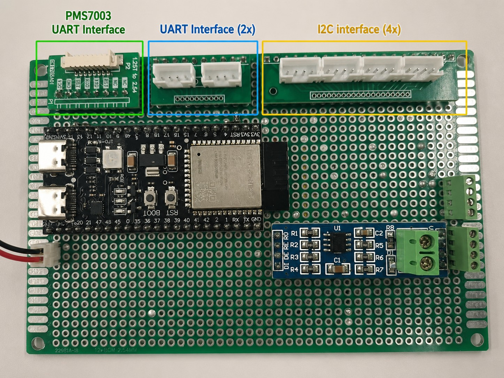
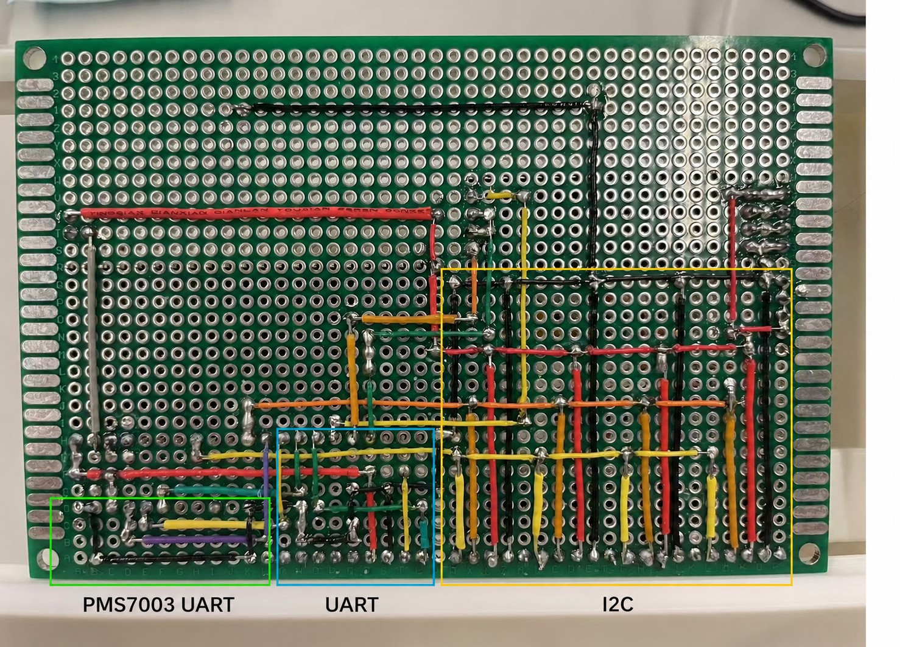
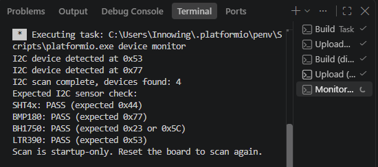
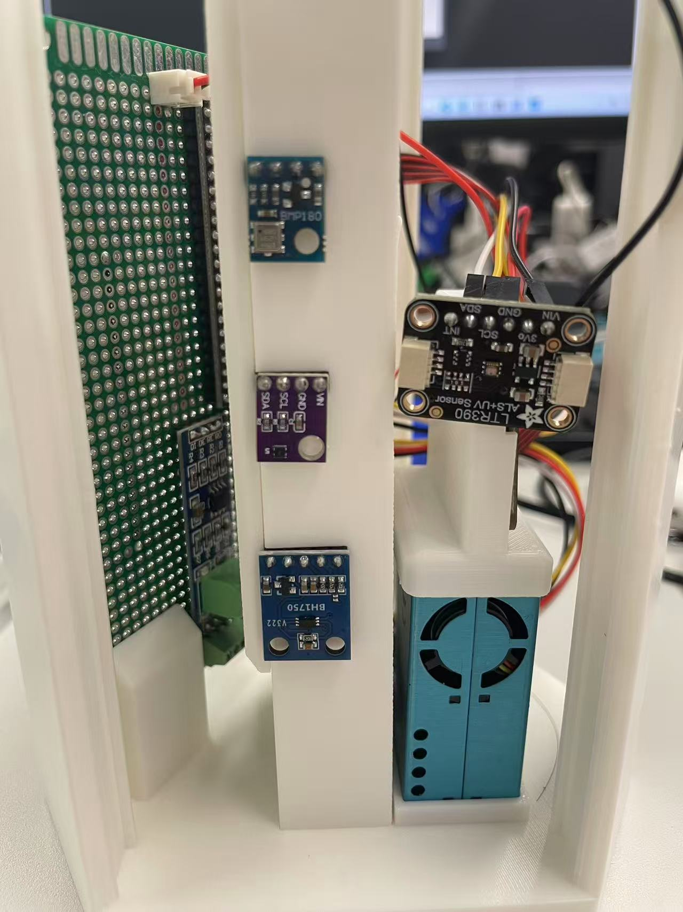
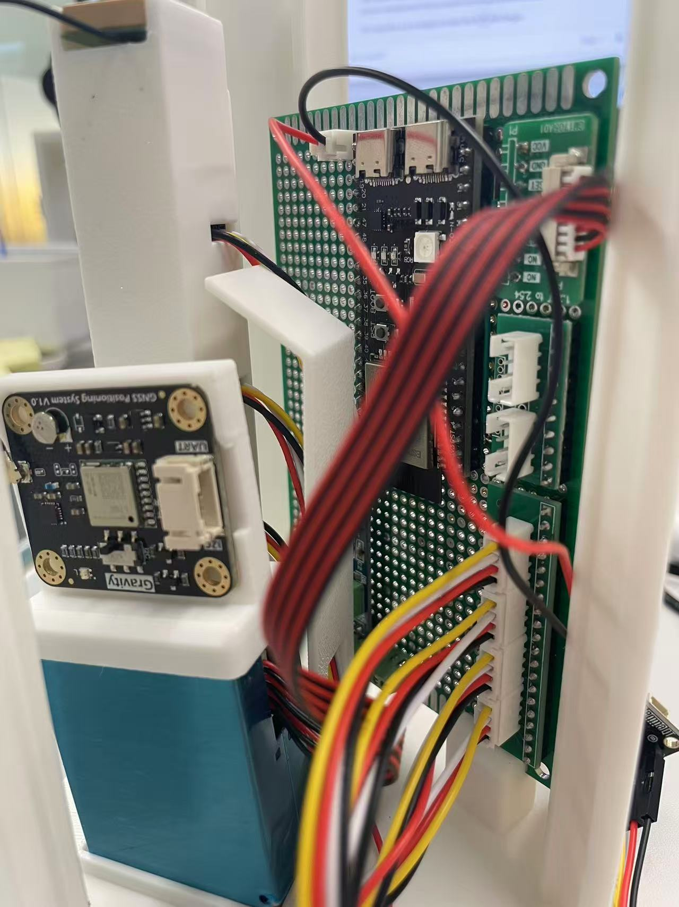
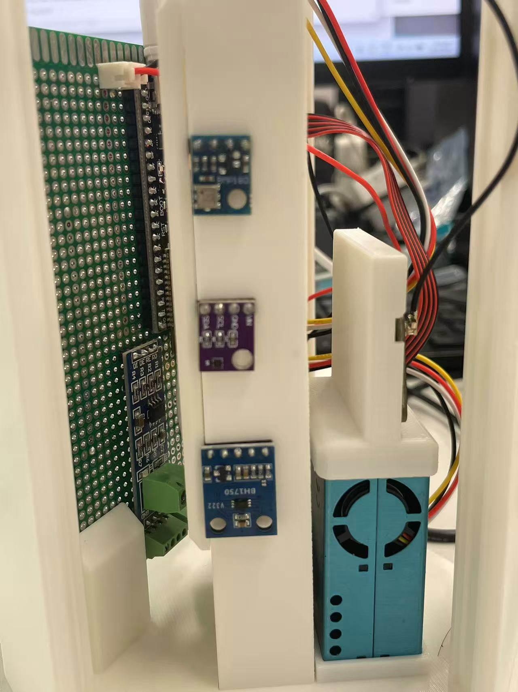

# v0.1 — Core Integrated Sensor Prototype

**Milestone status:** Complete  
**Verified result:** Four I²C sensor modules and one PMS7003 particulate subsystem operated together through a shared data and health model.  
**Not part of this milestone:** networking/backend, GNSS integration, wind integration, rain, power telemetry, predictions.

## 1. Objective

Convert the project from separate sensor and communications diagnostics into the first stable integrated weather-station firmware. v0.1 needed to acquire every core bench sensor without allowing one missing or failed device to stop the station.

## 2. Starting point

Early development established pin plans and isolated tests for I²C, PMS7003 UART, GNSS UART, and RS485 wind devices. Those tests were valuable, but they did not yet prove simultaneous sensor acquisition or a stable contract for later consumers. v0.1 made the sensor path the source of truth and kept experimental subsystems outside `main.cpp`.

## 3. Hardware involved

The production v0.1 path used these definitions from `firmware/include/pins.h` and `firmware/include/app_config.h`:

| Device | Measurement | Interface | ESP32-S3 assignment | Verification status |
| --- | --- | --- | --- | --- |
| ESP32-S3 DevKitC-1 build target | Control | — | PlatformIO board target | Integrated |
| SHT4x | Temperature, humidity | I²C `0x44` | SDA GPIO8, SCL GPIO9 | Hardware verified |
| BMP180 | Pressure | I²C `0x77` | SDA GPIO8, SCL GPIO9 | Hardware verified |
| BH1750 | Light | I²C `0x23` or `0x5C` | SDA GPIO8, SCL GPIO9 | Hardware verified |
| LTR390 | Raw UV, estimated UV index | I²C `0x53` | SDA GPIO8, SCL GPIO9 | Hardware verified |
| PMS7003 | PM1.0, PM2.5, PM10 | UART2, 9600 baud | RX GPIO16, TX GPIO17, SET GPIO18 | Hardware verified |

The I²C bus runs at 100 kHz. The exact fitted SHT40/SHT41 variant has not been independently established, so the project accurately identifies it as the SHT4x family. The current production sensor is BMP180, despite an earlier BOM draft naming BMP390.

See [pin allocation](../pin-allocation.md), [wiring](../../hardware/wiring.md), and the [current BOM](../../hardware/bom.md).

## 4. Software changes and architecture

```text
SHT4x ─┐
BMP180 ┤
BH1750 ┤
LTR390 ┤
        ├──> Sensor layer ──> WeatherData ──> validation / SensorHealth ──> Serial snapshot
PMS7003┘
```

- `SensorManager` owns the four I²C drivers and updates a shared `WeatherData` instance.
- `PMS7003Sensor` updates the particulate fields and reports frame diagnostics.
- `SensorHealth` records initialization, current validity, staleness, last success, consecutive failures, and total failures.
- Each I²C driver initializes and reads independently. An uninitialized sensor is retried on a later environmental cycle.
- `main.cpp` applies range checks and prints `unavailable` rather than confusing a missing value with a real zero.
- `millis()` scheduling runs I²C reads every 5 seconds, PMS acquisition every 10 seconds with a 1.5-second bound, and Serial snapshots every 10 seconds.

The detailed model and behavior remain documented in [Core v0.1 implementation notes](../core-v0.1.md).

## 5. Diagnostics

Diagnostics are preserved as isolated PlatformIO environments. Only one entry point is compiled at a time, which keeps experimental UART assignments and blocking diagnostic behavior out of production firmware.

| Environment | Purpose | Milestone meaning |
| --- | --- | --- |
| `diag_i2c` | Scan addresses and compare them with the four expected sensors | Core v0.1 bring-up tool |
| `diag_pms` | Read PMS7003 frames and report checksum/read failures | Core v0.1 bring-up tool |
| `diag_wind_direction` | Query the preserved Modbus wind-direction registers | Diagnostic only; not integrated |
| `diag_wind_speed` | Query the preserved Modbus wind-speed register | Diagnostic only; not integrated |
| `diag_gnss` | Inspect UART bytes, NMEA checksums, and fix state | Diagnostic only; not integrated |

From `firmware/`, flash and monitor a diagnostic:

```powershell
pio run -e diag_i2c -t upload
pio device monitor -b 115200
```

Return to the production application:

```powershell
pio run -e weather_station -t upload
```

Keeping diagnostics separate makes failures reproducible: a builder can prove electrical detection or UART framing first, then return to the integrated scheduler. See [Troubleshooting](../troubleshooting.md).

## 6. Testing procedure

1. Confirm power and logic levels for every breakout.
2. Flash `diag_i2c`; verify `0x44`, `0x77`, `0x23` or `0x5C`, and `0x53` are reported.
3. Flash `diag_pms`; verify valid 32-byte Plantower frames, checksum success, and plausible particulate fields.
4. Flash `weather_station` and monitor at 115200 baud.
5. Confirm all four I²C values and all three particulate values appear in the same structured snapshot.
6. Disconnect or disturb one sensor only during a controlled bench test; confirm other sensors continue and the affected health state reports failure/staleness.

The repository records that the integrated set was verified. It does not include a formal calibration record or long-duration environmental test log.

## 7. Problems encountered and resolutions

### I²C detection before driver debugging

**Problem:** A sensor-level failure can be caused by power, wiring, soldering, connector continuity, address selection, or driver behavior. Treating every failure as a software defect wastes time.

**Diagnostic method:** `diag_i2c` performs a startup-only bus scan and compares detected addresses with SHT4x `0x44`, BMP180 `0x77`, BH1750 `0x23`/`0x5C`, and LTR390 `0x53`.

**Result:** The supplied diagnostic capture shows four devices and PASS for all expected sensor checks. The capture visibly shows devices at `0x53` and `0x77`; the other two detected-address lines are outside the crop, so their addresses should not be inferred from the picture alone.

### BH1750 connection issue

**Problem:** The BH1750 did not initially appear as a working member of the shared bus.

**Method and resolution:** Bus scanning and physical connection inspection were used before changing the driver. The integrated baseline subsequently verified the BH1750, and the driver supports either standard address (`0x23` first, then `0x5C`). The repository does not retain enough detail to claim a more specific failed joint, cable, or connector, so none is asserted here.

### LTR390 read investigation

**Problem:** Address detection alone does not prove that useful LTR390 reads and the existing UV conversion path work.

**Method and resolution:** The bus scan established presence at `0x53`; the isolated driver and then the integrated `SensorManager` path established successful raw UV reads and an estimated UV index. No calibration-grade accuracy claim is made.

### PMS7003 UART and frame validation

**Problem:** Receiving UART bytes does not guarantee a valid PMS measurement; framing errors and misalignment can look like data.

**Method and resolution:** The parser searches for headers `0x42 0x4D`, checks the expected frame length, and validates the checksum before updating `WeatherData`. `diag_pms` exposes received-frame, checksum-error, read-failure, last-valid-frame, and SET-pin information.

### Diagnostics versus production firmware

**Problem:** Experimental GNSS/RS485 code and dedicated hardware tests could conflict with the production entry point or UART allocation.

**Resolution:** `platformio.ini` selects one diagnostic source per diagnostic environment and excludes `main.cpp` plus networking components. `weather_station` excludes the entire diagnostics directory.

## 8. Verified result

v0.1 demonstrated simultaneous operation of four I²C sensor modules and the PMS7003, unified acquisition in `WeatherData`, per-sensor health/error handling, and structured Serial weather snapshots. This stable read-only snapshot became the input to v0.2 networking rather than placing network logic inside sensor drivers.

## 9. Images and evidence



*Front-side connector layout. The yellow group exposes four shared-I²C connections; the blue and green groups preserve UART interfaces.*



*Back-side point-to-point wiring, labeled by PMS7003 UART, other UART, and I²C regions for inspection and continuity tracing.*



*Startup-only I²C diagnostic showing four devices found and PASS results for SHT4x, BMP180, BH1750, and LTR390.*



*Sensor-side assembly showing the environmental breakouts and PMS7003 mounted with open airflow during bench work.*



*Connected interface view showing the ESP32-S3, breakout connectors, harnesses, and adjacent communication module.*



*Prototype enclosure fit used to check component placement and cable routing; it is not evidence of weatherproofing or thermal suitability.*

<!-- TODO(v0.1 evidence): Add docs/images/v0.1/integrated-serial-output.png. Capture one complete structured WEATHER SNAPSHOT with all five health entries visible; redact Wi-Fi credentials and local IP addresses. -->

**Missing evidence:** `docs/images/v0.1/integrated-serial-output.png` has not been supplied.

## 10. Known limitations

- No networking or persistent storage belonged to v0.1.
- GNSS and wind had diagnostic code only; rain and power telemetry were deferred.
- Sensor accuracy was not calibrated against traceable references.
- The enclosure fit was a mechanical prototype, not a completed radiation shield or outdoor enclosure validation.
- PMS placement, airflow, condensation control, and long-duration contamination behavior were not field tested.

## 11. What came next

v0.2 consumed the validated `WeatherData` snapshot as JSON, added failure-tolerant Wi-Fi and HTTP upload, stored it in FastAPI/SQLite, and displayed it in a local dashboard. See [v0.2 — Connected IoT Prototype](v0.2-connected-iot.md).
