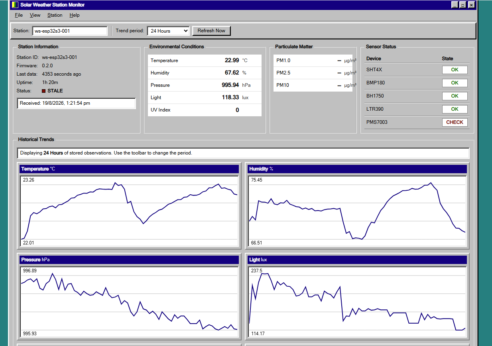

# v0.2 — Connected IoT Prototype

**Milestone status:** Complete  
**Verified result:** ESP32 → Wi-Fi → HTTP → FastAPI → SQLite → desktop/mobile browser dashboard on a reachable local network.  
**Not production-ready:** no TLS, authentication, offline backlog, cloud deployment, or autonomous field validation.

## 1. Objective

Extend the verified v0.1 sensor snapshot to a small, understandable connected system without weakening sensor acquisition when the network is absent or slow.

## 2. Starting point

v0.1 already provided independent drivers, `WeatherData`, range validation, health/staleness information, and Serial snapshots. v0.2 treated that snapshot as a read-only boundary and added communications after it.

## 3. Hardware involved

The sensor hardware and pins are unchanged from v0.1. Wi-Fi uses the ESP32-S3 radio. No GNSS, wind, rain, battery, or solar measurement is enabled by the `weather_station` environment.

## 4. Software changes and architecture

```text
v0.1: Sensors ─> WeatherData ─> Serial

v0.2: Sensors ─> WeatherData ─> JSON ─> Wi-Fi ─> HTTP
                                                   ↓
                                                FastAPI
                                                   ↓
                                                SQLite
                                                   ↓
                                               Dashboard
```

### Firmware

- `NetworkManager` implements `DISABLED`, `CONNECTING`, `CONNECTED`, `DISCONNECTED`, and `RETRY_WAIT` states. It starts Wi-Fi asynchronously, bounds an attempt to 15 seconds, and waits 30 seconds between attempts.
- Optional NTP is requested after connection and polled without a blocking synchronization loop. Until it succeeds, `device_timestamp` is `null`.
- `WeatherDataSerializer` produces the `weather.measurement.v1` JSON document. Invalid or stale readings become JSON `null`; a real numeric zero remains distinct.
- `HttpDataUploader` accepts the latest snapshot through a one-element overwrite queue and posts from a separate FreeRTOS worker. Connect/read timeouts are 3/5 seconds.
- Uploads are scheduled every 60 seconds. There is no immediate retry storm and no offline replay; the next current snapshot replaces an unsent queued snapshot.

### Backend and dashboard

- FastAPI validates the nested measurement and health schema.
- SQLite stores server/device timestamps, firmware and uptime, eight measurement fields, five validity flags, and the complete health JSON.
- `POST /api/v1/measurements` stores a snapshot.
- `GET /api/v1/measurements/latest` returns the newest observation, optionally for a station.
- `GET /api/v1/measurements` filters history by station/time and returns newest first.
- The static dashboard displays current conditions, station freshness, sensor health, and canvas-based trend charts for 1 hour, 24 hours, or 7 days.
- Responsive CSS supports narrow screens; operation has been verified from desktop and mobile browsers on a reachable local network.

HTTP was selected because direct request/response behavior is easy to inspect with the FastAPI docs, a browser, or command-line tools and is sufficient for one local prototype. MQTT, broker operations, device identity, secure transport, and cloud services would add complexity before their requirements are established. The earlier MQTT document is retained as [design history](../mqtt-and-json.md), not as implemented behavior.

Full payload and failure cases are in [Core v0.2 implementation notes](../core-v0.2.md).

## 5. Testing procedure

1. Create `firmware/include/secrets.h` from `secrets.example.h` and use placeholder/local credentials only.
2. Set `BACKEND_HOST` to the backend computer's reachable LAN IP.
3. Create a Python 3.11 virtual environment, install `backend/requirements.txt`, and start Uvicorn on `0.0.0.0:8000`.
4. Run `python -m pytest -q` in the backend environment.
5. Flash `weather_station` and observe Wi-Fi state plus `HTTP upload: OK (code=201)` over Serial.
6. Query the latest endpoint and confirm `backend/weather.db` receives a row.
7. Open the dashboard on the backend computer and, where the LAN permits it, another desktop/mobile device.
8. Stop the backend or disconnect Wi-Fi briefly; confirm sensing and Serial snapshots continue, then confirm later snapshots resume after recovery.

## 6. Problems encountered and solutions

### Network work must not block sensors

The solution separates `NetworkManager::tick()` from acquisition and runs HTTP in a worker with bounded timeouts. Sensor drivers do not know about Wi-Fi or HTTP.

### Time may be unavailable

The device sends uptime in every payload and a nullable UTC device timestamp. SQLite always records the backend's UTC receive time, which is authoritative for v0.2 display/history.

### Backend outages can outlast device memory

v0.2 intentionally keeps only the latest queued conditions. This avoids an unbounded in-memory queue but loses outage-period readings. Durable offline backlog/replay is planned work and must include ordering and duplicate-handling rules.

### Local-network reachability varies

The backend binds to `0.0.0.0`; the firmware uses the computer's LAN address. Host firewall rules or Wi-Fi client isolation can still block ESP32-to-computer traffic. See [Troubleshooting](../troubleshooting.md).

## 7. Verified result

The completed v0.2 baseline sends real sensor snapshots end to end from the ESP32 to FastAPI/SQLite and presents them through the local dashboard. Backend API tests cover successful storage/retrieval, malformed input rejection, null unavailable fields, missing-station behavior, and dashboard serving.

## 8. Images and evidence



*Desktop dashboard displaying a station snapshot and 24-hour stored trends. The shown PMS state is CHECK because particulate values were unavailable in that particular captured snapshot; it does not override the separately verified v0.1 PMS baseline.*

<!-- TODO(v0.2 evidence): Add docs/images/v0.2/dashboard-mobile.png. Capture the responsive dashboard on a phone connected to the same reachable development network; avoid exposing a private IP in the image. -->
<!-- TODO(v0.2 evidence): Add docs/images/v0.2/system-architecture.png only if a maintained diagram adds value beyond the text architecture above. Do not create a decorative or inaccurate diagram. -->
<!-- TODO(v0.2 evidence): Add docs/images/v0.2/trend-example.png as a focused historical-chart capture from stored observations. The desktop image already contains charts, so avoid reusing the same screenshot. -->

**Missing evidence:** `dashboard-mobile.png`, `system-architecture.png`, and `trend-example.png` have not been supplied.

## 9. Known limitations

- Trusted LAN only: plain HTTP, no authentication or authorization.
- No durable device-side backlog, delivery acknowledgement store, or replay.
- No production deployment, database migration system, retention policy, or multi-user operations.
- SQLite is appropriate for this prototype, not a claim of high-volume scalability.
- Dashboard charts are simple local views, not calibrated analysis or forecasting.
- GNSS, wind, rain, battery, solar, and predictions remain outside the production data model.
- Desktop/mobile reachability depends on local router/firewall policy.

## 10. What comes next

v0.3 was subsequently completed after its standalone diagnostic proved power, UART communication, NMEA/checksum monitoring, UTC/date, position interpretation, hemispheres, satellites, altitude, and a valid fix. It then added nullable GNSS fields, additive database migration, and remote display without redefining the v0.2 milestone. See [v0.3 — GNSS Integration](v0.3-gnss-integration.md).
