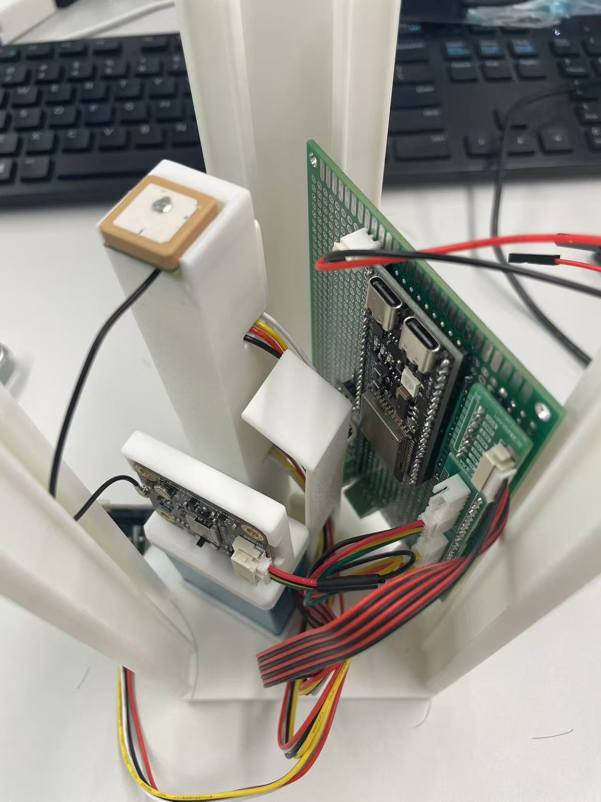
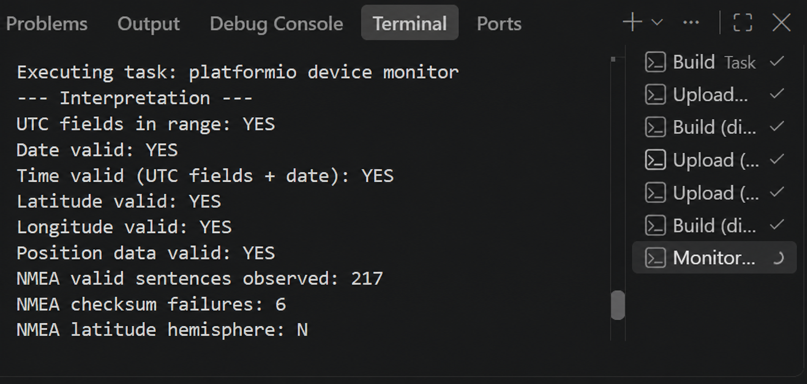
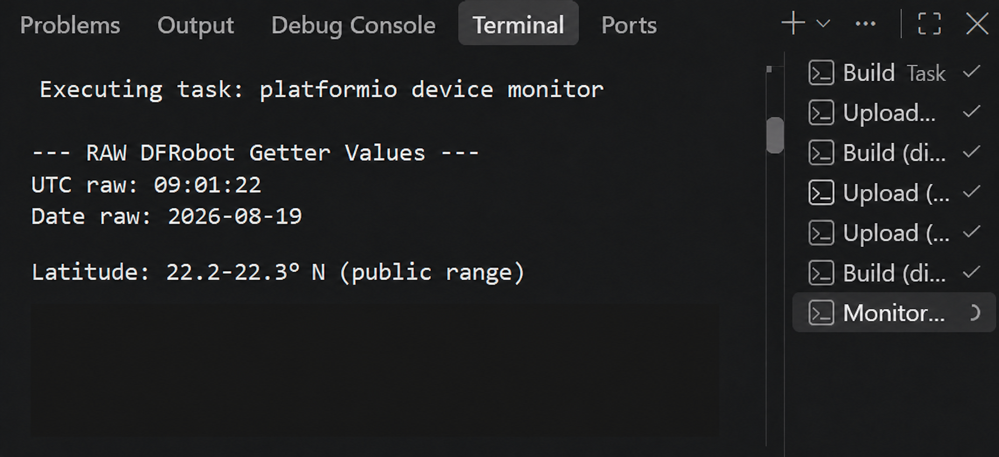
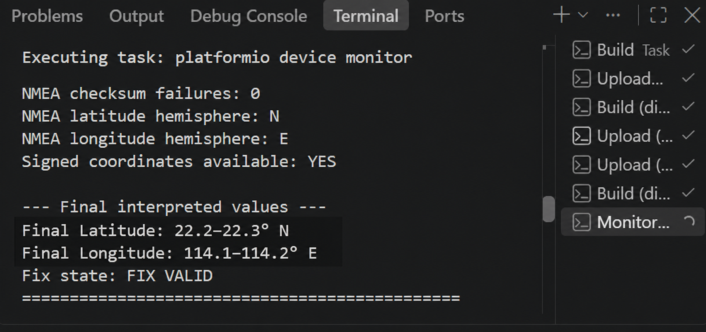
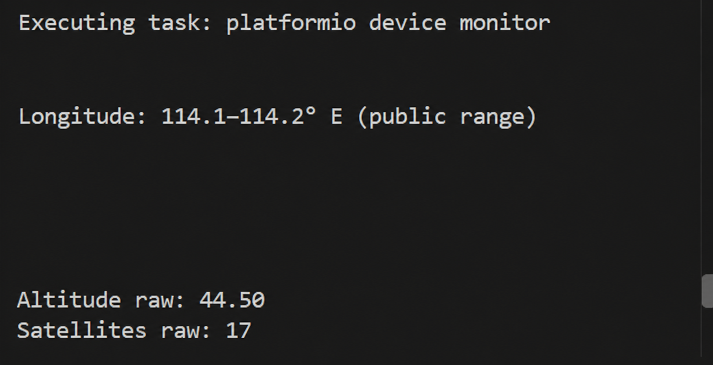
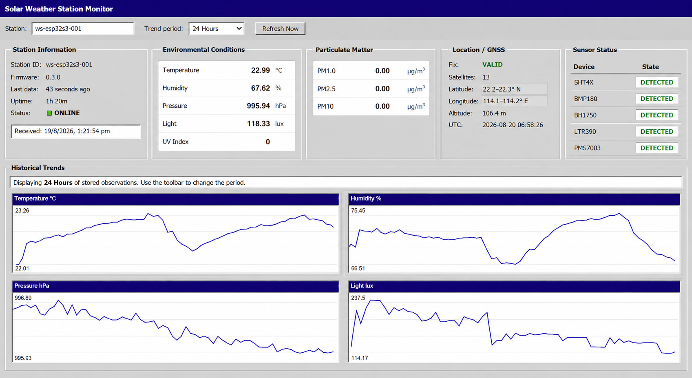

# v0.3 — GNSS Integration

**Milestone status:** Complete / hardware verified

**Verified result:** The GNSS receiver was first verified independently, then integrated with the existing environmental sensors, PMS7003, Wi-Fi/HTTP transport, FastAPI validation, SQLite storage, and remote dashboard.

**Not part of this milestone:** wind integration, rain, battery/solar telemetry, prediction, maps/tracking, or autonomous field validation.

## 1. Overview and objective

v0.3 integrates the GNSS subsystem into the already working v0.2 weather-station pipeline while first verifying the receiver independently through the dedicated `diag_gnss` environment. It is an incremental extension: the v0.1 sensor baseline and v0.2 connected pipeline remain in service.

```text
Physical GNSS installation
        ↓
Standalone GNSS diagnostic
        ↓
UART → NMEA → UTC/date → position → hemisphere/sign → fix verification
        ↓
Main firmware and WeatherData integration
        ↓
JSON → HTTP → FastAPI → SQLite → remote dashboard
        ↓
Existing sensors and PMS7003 verified alongside GNSS
        ↓
v0.3 complete
```

## 2. Starting point and historical boundary

v0.2 already provided four shared-I²C sensors, PMS7003 UART acquisition, `WeatherData`, health/staleness handling, non-blocking Wi-Fi, optional NTP, HTTP upload, FastAPI, SQLite, and current/history display. GNSS existed only as an isolated diagnostic and was explicitly disabled in production.

v0.3 does not rewrite that history. It promotes the verified GNSS path into production while preserving the earlier data path:

```text
SHT4x ─┐
BMP180 ┤
BH1750 ┤
LTR390 ┤
PMS7003┼──> WeatherData + validity ──> Serial / JSON ──> HTTP
GNSS ──┘                                                    ↓
                                                          FastAPI
                                                            ↓
                                                          SQLite
                                                            ↓
                                                    live + historical UI
```

## 3. Hardware added

| Item | Implemented configuration | Status |
| --- | --- | --- |
| GNSS module | DFRobot Gravity TEL0157 with Quectel L76K | Hardware verified |
| Constellation mode | GPS + BeiDou + GLONASS | Configured by production firmware |
| Interface | UART selector position, 9600 baud | Verified |
| Supply | Module supports 3.3–5.5 V; this project uses 3V3 | Verified configuration |
| Antenna | Active antenna connected to the module's IPEX1 socket | Installed and used for fix testing |
| Library | `DFRobot_GNSS` from the Git dependency in `platformio.ini` | Production and diagnostic |
| Firmware class | `GPSManager` plus `GnssNmeaHemisphere` | Production |
| Diagnostic | PlatformIO environment `diag_gnss` | Hardware verified |

Actual pin assignments from `firmware/include/pins.h`:

| Signal | ESP32-S3 assignment | Direction |
| --- | --- | --- |
| TEL0157 TX (`D/T`) | GPIO15 / UART1 RX | GNSS → ESP32 |
| TEL0157 RX (`C/R`) | GPIO14 / UART1 TX | ESP32 → GNSS |
| VCC | 3V3 | Power |
| GND | GND | Common reference |

PMS7003 remains on UART2 GPIO16/17 with SET on GPIO18. Wind diagnostic UART assignments are unchanged and remain isolated builds.

## 4. Physical installation

The module and antenna were fitted into the developing electronics assembly before final integrated verification. This image demonstrates installation and cable routing, not weatherproofing, antenna environmental qualification, or final enclosure approval.



*v0.3 GNSS hardware installation — GNSS integrated into the existing ESP32-S3 weather-station assembly before final software verification.*

Installation sequence:

1. Remove power before moving the TEL0157 interface selector to UART.
2. Seat the active antenna connector firmly.
3. Cross TX/RX according to the table above and use a common ground.
4. Recheck continuity and connector seating after mounting.
5. Test with a clear sky view and allow time for a cold acquisition.

See [wiring](../../hardware/wiring.md), [pin allocation](../pin-allocation.md), and the [BOM](../../hardware/bom.md).

## 5. Communication and firmware components

### Production path

`GPSManager` owns a `HardwareSerial` instance on UART1 and a `DFRobot_GNSS_UART` instance. All blocking library probes and reads run in the priority-1 `gnss-worker` FreeRTOS task. The Arduino loop calls `GPSManager::update()`, which only copies a mutex-protected snapshot into the shared `WeatherData`.

Current compile-time behavior from `app_config.h`:

- GNSS enabled in `weather_station`;
- 10-second GNSS read period;
- 30-second fix-stale threshold;
- 30-second communication timeout;
- 60-second retry when the receiver is not detected.

This separation means a missing receiver or slow library call cannot directly block environmental reads, PMS acquisition, Wi-Fi maintenance, HTTP scheduling, or Serial snapshots.

### NMEA support

`GnssNmeaHemisphere` consumes callback bytes from `getAllGnss()`. It:

- frames sentences beginning with `$`;
- calculates and verifies the NMEA XOR checksum;
- counts valid sentences and checksum failures;
- recognizes fix-bearing GGA, RMC, and GLL sentences;
- accepts N/S and E/W only from checksum-valid sentences whose fix/status field is valid.

Valid-sentence and checksum-failure totals are diagnostic counters, not fixed expected numbers. Different real runs can legitimately show different counts; persistent or rapidly increasing failures are evidence to investigate signal integrity or communication quality.

## 6. Dedicated diagnostic environment

GNSS was tested alone before entering the complete station so power, UART wiring, raw messages, library interpretation, and sky/fix conditions could be separated from network and sensor scheduling.

From `firmware/`:

```powershell
pio run -e diag_gnss -t upload
pio device monitor -b 115200
```

The diagnostic offers status/raw inspection and reports communication, module mode, raw DFRobot fields, interpreted validity, NMEA counters, hemispheres, signed coordinates, satellite use, altitude, and fix state. Diagnostic builds replace the application in flash but do not modify source files.

Restore the integrated station after testing:

```powershell
pio run -e weather_station -t upload
pio device monitor -b 115200
```

## 7. Independent diagnostic procedure

1. Power off and verify selector, antenna, VCC/GND, and crossed TX/RX wiring.
2. Flash `diag_gnss` and monitor at 115200 baud.
3. Confirm the module responds and NMEA bytes/sentences arrive.
4. Inspect valid-sentence and checksum-failure counters over time.
5. Verify UTC fields and the calendar date pass range checks.
6. Verify latitude and longitude magnitudes pass range checks.
7. Confirm N and E/W hemisphere fields are recovered from checksum-valid NMEA.
8. Confirm signed decimal coordinates become available.
9. Confirm at least one satellite is used and the diagnostic reports `FIX VALID`.
10. Observe altitude and satellite-count reporting without treating one captured numeric value as a specification.

### Verification categories

| Independent GNSS test | Result |
| --- | --- |
| UART communication | Verified |
| NMEA reception | Verified |
| NMEA validity monitoring | Verified |
| NMEA checksum monitoring | Verified |
| UTC fields | Verified |
| Date | Verified |
| Combined time validity | Verified |
| Latitude magnitude | Verified |
| Longitude magnitude | Verified |
| Hemisphere handling | Verified |
| Signed coordinate conversion | Verified |
| Satellite count | Verified |
| Altitude | Verified |
| Valid position fix | Verified |



*Basic validity evidence — UTC/date/time and position checks passed while valid-sentence and checksum counters remained visible. The personal command path was removed for publication.*

## 8. Raw coordinates, hemispheres, and signed values

The DFRobot library returns structured degrees/minutes components and decimal-degree magnitudes. On the tested module/library combination, the separate DFRobot direction-byte getters were malformed even though coordinate magnitudes and NMEA output were valid. The project therefore does not use those bytes to sign production coordinates.

The implemented interpretation path is:

```text
DFRobot raw coordinate components
        ↓
DFRobot decimal-degree magnitude
        +
checksum-valid NMEA N/S and E/W
        ↓
S or W negates the magnitude; N or E keeps it positive
        ↓
signed latitude / longitude
        ↓
validity and current-fix assessment
```

`diag_gnss.cpp` exposes the raw and interpreted values for diagnosis. Production signing occurs in `GPSManager::publishSnapshot()`. `GPSManager::currentFixIsValid()` requires at least one satellite, valid UTC and date, finite in-range magnitudes, and both NMEA hemispheres. The code intentionally does not patch generated `.pio/libdeps` library files.



*Raw interpretation evidence — DFRobot UTC/date output remained visible; all precise latitude components were covered and replaced with a coarse public range.*



*Signed-coordinate and fix evidence — the N/E hemisphere interpretation and valid fix remain visible while exact coordinates are irreversibly redacted.*



*Navigation-data evidence — altitude and satellite reporting are retained; the precise longitude block and personal command path were replaced with public-safe text.*

## 9. Main firmware and `WeatherData`

`main.cpp` starts `GPSManager` when `EnableGnss` is true, copies its latest snapshot during normal loops and before upload, and includes GNSS status in structured Serial output. It does not put GNSS library calls into the sensor scheduler.

`WeatherData` now carries:

- `gnssCommunicationOk`, `gnssFixValid`, `gnssUtcValid`, and `GnssState`;
- GNSS year/month/day/hour/minute/second;
- signed latitude/longitude and altitude;
- satellites, speed, course, and constellation mode;
- last-successful-fix uptime;
- raw-byte, valid-sentence, and failed-checksum diagnostic counters.

The four production states are:

| State | Meaning | Uploaded position |
| --- | --- | --- |
| `NOT CONNECTED` | No recent NMEA communication | `null` |
| `COMMUNICATION OK - NO FIX` | Receiver is communicating but has not produced a valid fix | `null` |
| `FIX VALID` | Current fix passes validation and freshness checks | Signed values |
| `FIX STALE` | Communication continues but the last valid fix is no longer current | `null` |

Last successful values remain internally useful for diagnostics, but unavailable or stale positions are not presented as a false `0.0` coordinate.

## 10. JSON and network transmission

`WeatherDataSerializer` adds a nested `gnss` object to the existing `weather.measurement.v1` envelope:

| JSON field | Availability rule |
| --- | --- |
| `state` | Always present |
| `communication_ok`, `fix_valid` | Always present |
| `utc` | Present when the GNSS UTC snapshot is valid; otherwise `null` |
| `latitude`, `longitude` | Present only for `FIX VALID`; otherwise `null` |
| `altitude_m`, `speed_kmph`, `course_deg` | Present only for a valid current fix and finite value |
| `satellites` | Present when communication is current |
| `mode` | Present when the library mode maps to a known label |
| `last_successful_fix_ms` | Present after a successful fix |

GNSS uses the same 60-second HTTP snapshot schedule as the rest of `WeatherData`. No-fix or disconnected GNSS does not cancel an upload: environmental and particulate values continue through the v0.2 pipeline with GNSS fields marked unavailable.

See [Core v0.3 implementation notes](../core-v0.3.md) for the complete payload example.

## 11. Backend, SQLite, APIs, and display

### Validation and storage

The Pydantic `Gnss` model validates the four state strings and nullable UTC, latitude, longitude, altitude, satellites, speed, course, mode, and last-fix uptime. A missing `gnss` object defaults to `NOT CONNECTED`, preserving compatibility with v0.2 senders.

SQLite stores these columns:

```text
gnss_state, gnss_communication_ok, gnss_fix_valid, gnss_utc,
latitude, longitude, altitude, satellites, gnss_speed_kmph,
gnss_course_deg, gnss_mode, gnss_last_successful_fix_ms
```

Startup inspects `PRAGMA table_info(measurements)` and adds only missing GNSS columns. It does not drop the table or delete existing v0.2 observations. Both latest and history API responses reconstruct the nested `gnss` object from stored columns.

### Remote display

The dashboard's Location / GNSS group displays:

- fix state;
- satellites;
- signed latitude/longitude rendered with hemisphere labels;
- altitude;
- GNSS UTC.

It does not provide a map, route tracking, geofencing, or location-history chart.



*v0.3 integrated verification — environmental, particulate, and GNSS data operating together through the complete station data pipeline. Location precision has been intentionally reduced for public documentation.*

### Integration verification

| End-to-end test | Result |
| --- | --- |
| Main firmware GNSS integration | Verified |
| Existing environmental sensors retained | Verified |
| PMS7003 retained | Verified |
| Wi-Fi and HTTP transmission | Verified |
| FastAPI validation | Verified |
| SQLite reception/storage | Verified |
| Latest/history API GNSS response | Verified |
| Remote GNSS display | Verified |

The integrated screenshot is evidence that the sensor system remained active while the dashboard received GNSS. Individual captured measurement, coordinate, UTC, altitude, and satellite values are observations from a test run, not permanent specifications.

## 12. Time sources

v0.3 contains four distinct time concepts:

| Time source | Role |
| --- | --- |
| ESP32 uptime | Scheduler timing, age/freshness, and `uptime_ms`; valid without network or fix |
| NTP | Supplies top-level `device_timestamp` when Wi-Fi time synchronization succeeds |
| GNSS UTC | Date/time belonging to the last valid GNSS fix; stored as `gnss.utc` |
| Backend receive UTC | `server_timestamp`, generated on ingestion and authoritative for SQLite ordering/dashboard freshness |

GNSS UTC does not replace NTP in v0.3. Before a valid fix, GNSS UTC can be `null`; uploads and backend timestamps continue independently.

## 13. Graceful degradation

The code supports this failure path:

```text
GNSS absent / no fix / stale fix
        ↓
explicit GNSS state + null current position
        ↓
I²C sensors and PMS7003 continue
        ↓
Wi-Fi/HTTP uploads continue
        ↓
backend and dashboard remain operational
```

A failed boot probe is retried every 60 seconds. A communicating receiver waiting for satellites is not repeatedly reset. The milestone evidence verifies integrated operation; long-duration antenna-disconnect and receiver-reconnect fault-injection logs remain desirable follow-up evidence.

## 14. Problems and engineering considerations

### Library direction bytes were unreliable

The official structured getters supplied useful magnitudes, but separate direction getters did not produce valid N/S/E/W values on the tested combination. The resolution was a small project-owned NMEA parser for checksum-validated hemisphere fields, leaving the dependency untouched.

### Communication is not the same as a fix

UART bytes, valid NMEA, valid time, valid magnitudes, hemispheres, and satellites are separate checks. The four-state model prevents “module connected” from being mistaken for “position current.”

### Checksums vary by run

One evidence capture shows checksum failures while another test run showed none. The counter is for trend/quality diagnosis, not a fixed pass threshold. A successful fix requires fix-bearing information from checksum-valid sentences.

### GNSS can expose sensitive location

The backend stores precise coordinates when a valid fix is uploaded. v0.3 has no authentication or TLS, so it must remain on a trusted development network. Logs, screenshots, database exports, issues, and examples must be reviewed before publication.

## 15. Privacy handling for public evidence

The original diagnostic and dashboard screenshots contained a precise real-world test location and personal Windows paths. Those originals remain outside the repository.

Public copies use irreversible opaque replacement, not blur:

- exact latitude and longitude components were completely covered;
- coarse ranges such as `22.2–22.3° N` and `114.1–114.2° E` were inserted;
- personal filesystem paths were replaced with generic PlatformIO task text;
- UTC/date, validity, NMEA counters, hemispheres, satellite count, altitude, fix state, and system evidence remain visible.

Public documentation must never treat the coarse values as the station's configured or permanent location.

## 16. Reproducing v0.3 end to end

1. Build the complete v0.1 sensor/PMS hardware and verify it using those diagnostics.
2. Start the v0.2 backend/dashboard and verify a non-GNSS measurement reaches SQLite.
3. Install and wire the TEL0157 as documented above.
4. Flash `diag_gnss`; verify UART, valid NMEA, UTC/date, position magnitudes, hemispheres, signed coordinates, satellites, altitude, and fix.
5. Restore `weather_station` and confirm firmware reports version `0.3.0` plus the pre-existing sensor readings.
6. Confirm GNSS progresses to `FIX VALID` without stopping scheduled sensor snapshots.
7. Confirm HTTP returns success and query `/api/v1/measurements/latest?station=...`.
8. Verify the nested `gnss` object and corresponding SQLite columns.
9. Open the dashboard and verify the Location / GNSS group alongside sensor health and trends.
10. If a stage fails, return to the smallest relevant diagnostic before changing production code. See [Troubleshooting](../troubleshooting.md).

## 17. Known limitations

- Position is current-fix telemetry, not tracking or location-history visualization.
- HDOP and other dilution/accuracy fields are not stored or used as acceptance thresholds.
- Fix timing, stale thresholds, and probe retry periods are compile-time constants.
- GNSS UTC is telemetry and does not discipline the device clock.
- The backend stores precise location without TLS, authentication, access control, or retention policy.
- Outdoor antenna/enclosure durability, cold/warm time-to-fix distribution, recovery logs, and long-duration reliability are not yet documented.
- Wind, rain, battery, solar, prediction, and autonomous operation remain unimplemented in the main station.

## 18. Final result and next milestone

v0.3 is complete and hardware verified. GNSS was validated independently before integration; the ESP32 now acquires explicit GNSS state and current-fix data without replacing the v0.1 sensors or v0.2 network pipeline. GNSS reaches JSON, FastAPI, SQLite, latest/history responses, and the remote display. Public evidence does not expose the precise test position.

The next planned milestone is **v0.4 — Wind Subsystem Integration**:

- integrate wind direction and speed through RS485/Modbus;
- resolve final UART/bus coexistence, including the preserved wind-speed UART0/debug-console conflict;
- extend `WeatherData`, JSON, backend schema/storage, and dashboard;
- verify wind and GNSS together with all previous sensors;
- capture combined reliability and failure-recovery evidence.

v0.4 remains planned; no wind production integration is claimed here.
