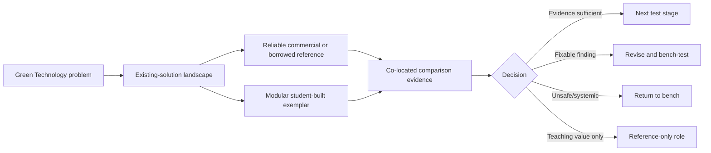

# From an Open Problem to a Defensible Direction — Gates A–E

This page is the one-screen teaching summary. It shows how a Green Technology team moves from an appealing idea to a conditional engineering direction without pretending that a prototype, stakeholder preference or sustainability label is proof.

## The complete decision story

| Gate | Question | Evidence shown in this exemplar | Outcome | What changed next |
|---|---|---|---|---|
| **A — Instructor decision** | What real decision must the evidence support? | Real instructor responses | Decide whether a supervised first field test should `proceed`, `revise`, return to bench or use a reference only | Requirements became decision-focused rather than “collect more data” |
| **B — TA workflow** | Can a teaching team actually execute and escalate the test? | Real TA responses confirmed by the instructor | Short checklists, role boundaries, stop authority and realistic workload identified | Added operator, anomaly and contact guidance; real dry run remains open |
| **C — Site feasibility** | Can a specific place, mounting and access plan be authorised and operated safely? | Instructor requirements plus a clearly labelled fictional completed example | The class can compare an open site and a controlled site without claiming HKU permission | Real deployment must still obtain responsible-staff approval and access evidence |
| **D — Decision alignment** | Would two roles interpret the same ambiguous evidence consistently? | Synthetic 72-hour case, real instructor decision, fictional TA role-play and synthetic alignment | `Revise`: do not redeploy unchanged; retain the architecture and requalify named subsystems | Separates safety/authority agreement from differing technical hypotheses |
| **E — Strategy re-score** | Should the team buy, borrow, adapt or continue building? | Evidence-backed landscape, published matrix and synthetic sensitivity workshop | Select Concept E: reliable reference + modular educational prototype | Moves the project into build–test–compare while preserving claim boundaries |

## Final direction

The commercial/borrowed instrument and student-built prototype have different jobs. The first supplies comparison or dependable data; the second supplies active engineering learning. Neither role should impersonate the other.

## Evidence labels students must preserve

| Label | Meaning in this repository |
|---|---|
| **Real stakeholder evidence** | Gate A instructor and Gate B TA responses |
| **Teaching simulation** | Gate C fictional site completion, Gate D operating data/TA role-play/alignment and Gate E role-play workshop |
| **Still unverified** | exact site permission/access, reference availability, current quotations, prototype performance, accuracy, energy balance and 72-hour result |

## How students reuse the framework

Replace “weather station” with the team’s own Green Technology challenge, then preserve the logic:

1. name the stakeholder and decision;
2. study existing commercial, open and research solutions;
3. learn from a reference rather than starting blindly from zero;
4. define what evidence changes the decision;
5. build, test, fail, reflect and revise;
6. compare alternatives again before committing more time or money; and
7. publish evidence and limitations, not just the final product.

Gate E is not the end of the project. It is the transition from **choosing a defensible direction** to the open engineering cycle: requirements → prototype → subsystem evidence → integration → field validation → reflection → release.

