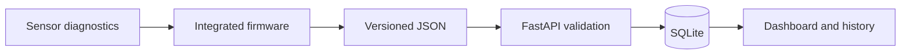

# Gate 03: Plan

## Selected route

Build a modular station around an ESP32-S3 and keep acquisition, health tracking, communications, storage and presentation separate enough to test independently.

## Main design decisions

| Decision | Selected approach | Reason |
| --- | --- | --- |
| Controller | ESP32-S3 | Multiple interfaces, Wi-Fi, native USB and supported PlatformIO workflow |
| Sensor integration | Dedicated drivers with shared `WeatherData` and health state | One failed device should not invalidate the entire station |
| Bring-up | Separate PlatformIO diagnostic environments | Wiring and protocol faults can be isolated before integration |
| Data transport | Periodic local HTTP upload | Small, inspectable v0.2 path without a broker or cloud dependency |
| Backend | FastAPI + SQLite | Typed validation, simple local persistence and testable endpoints |
| Schema evolution | Nullable fields and additive database migration | Older records remain readable as new sensors are added |
| GNSS | Independent worker and explicit no-fix state | Waiting for a fix must not stop other sensing or NTP |
| Wind speed | Dedicated RS485 worker | Modbus timeouts must not block the main acquisition path |
| Mechanical design | Editable Fusion 360 modules | Enclosure, power section and connecting base can be revised separately |

## Build sequence

1. Verify each bus and sensor in isolation.
2. Integrate core environmental and particulate sensing.
3. Add local networking, storage and dashboard behavior.
4. Diagnose GNSS independently, then add it without coupling time or sensing to a valid fix.
5. Verify wind speed on RS485, then promote only the verified protocol into production.
6. Complete combined hardware verification before adding rain or power telemetry.
7. Measure power and enclosure performance before autonomous outdoor operation.

## Risk controls

- keep credentials outside version control;
- keep precise location data off public systems;
- use a trusted local network because HTTP has no TLS or authentication;
- use 3.3 V-compatible logic at ESP32 pins;
- isolate the 12 V wind-sensor supply and protect outdoor cabling;
- keep planned, compiled, bench-verified and field-verified work visibly different; and
- require an approved site and safe retrieval plan before outdoor deployment.

## Gate decision

Proceed with the staged modular route. A commercial or borrowed reference instrument should be used during later field comparison; it is a validation reference, not a replacement for the inspectable prototype.
