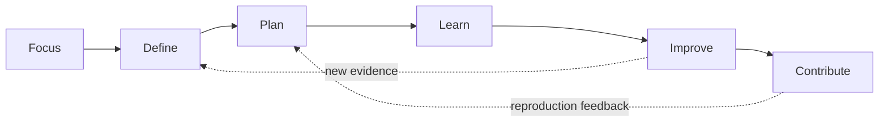

# Project Journey

The Solar Weather Station develops through six connected engineering decisions. The Gates are not a one-way checklist. New evidence can change an earlier problem statement, architecture choice, test or release decision.

| Gate | Decision | Current outcome |
| ---: | --- | --- |
| [01 Focus](01-focus.md) | Which Green Technology challenge should the project pursue? | Build an inspectable local microclimate platform while keeping sustainability claims evidence based |
| [02 Define](02-define.md) | What problem, user and boundary define useful work? | Support supervised, site-specific observation and engineering validation; do not claim meteorological-grade accuracy |
| [03 Plan](03-plan.md) | Which system architecture and validation route are responsible? | Modular ESP32-S3 sensing, isolated diagnostics, local backend and staged integration |
| [04 Learn](04-learn.md) | What did each working version teach? | Four milestones moved from core sensors to connected data, GNSS and wind speed |
| [05 Improve](05-improve.md) | What does the evidence justify changing next? | Finish combined v0.4 verification before adding new field features |
| [06 Contribute](06-contribute.md) | What is safe, clear and useful to release? | Publish source, editable CAD, tests, evidence, limits and contribution rules under an open licence |

## Evidence path

The detailed implementation record remains chronological under [`docs/milestones/`](../milestones/). The Gate documents explain the decisions across those versions; the milestone documents show what was built and observed at each stage.

## How to read the evidence

- **Source code** shows an implementation, not physical performance.
- **Automated tests** show that software behavior meets the checked conditions.
- **Diagnostic logs and bench photographs** support the named subsystem test.
- **Integrated hardware evidence** supports only the configuration and procedure recorded in that milestone.
- **Field claims** require an approved site, versioned configuration, raw observations, reference information and a recorded decision.

The [system test matrix](../../tests/test-matrix.csv) is the index of supported and pending claims.
