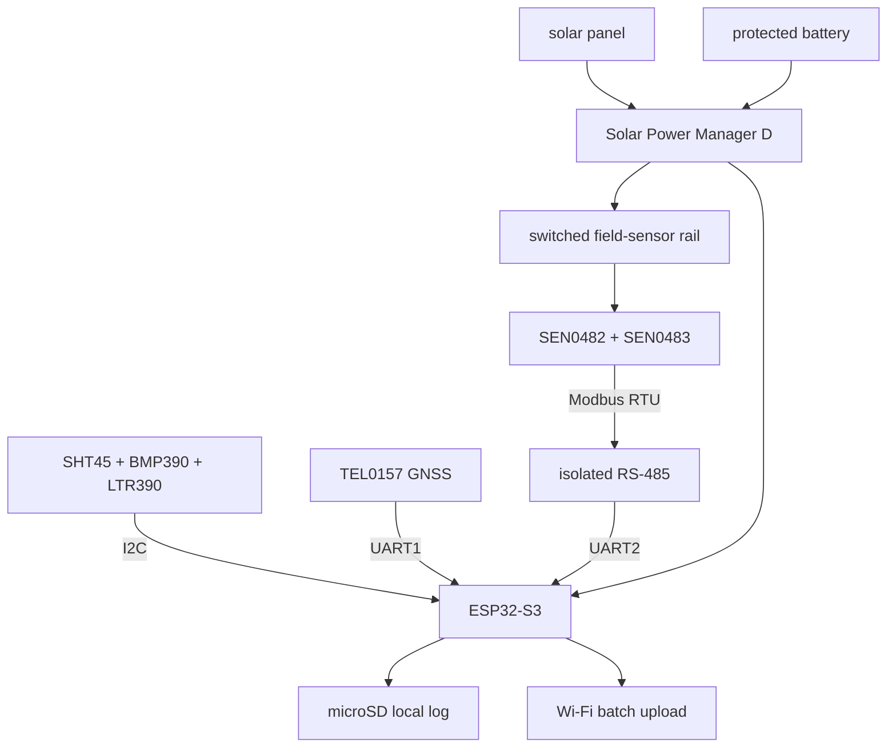

# Integrated Prototype v0.2 — Teaching Preview Baseline

> **SYNTHETIC / DESIGN COMPLETE, PHYSICAL BUILD NOT CLAIMED.** This is the finished repository presentation for Issue #1. It identifies an exact, internally consistent configuration and links synthetic evidence. Replace the preview labels with photographs, serial numbers, measured logs and signed inspections only after a real assembly exists.

## Question answered

Can the project be documented as one reproducible configuration—from sensor choice and power path through firmware schema, enclosure, BOM and 72-hour evidence—rather than as disconnected subsystem ideas?

## Configuration baseline

| Layer | v0.2-preview baseline | Source of truth |
|---|---|---|
| Controller | ESP32-S3-DevKitC-1-N8R8 | [interface map](../../hardware/v0.2-interface-map.md) |
| Environmental sensing | SHT45 + BMP390 + LTR390 | [ADR-004](adr/ADR-004-environmental-sensor-set.md) |
| Wind | DFRobot SEN0483 speed + SEN0482 direction on Modbus RTU | [BOM](../../bom/bom.csv) and interface map |
| Time/location | DFRobot TEL0157 | interface map |
| Data | local microSD first; remote upload is secondary | [data schema](../../dashboard/data-schema-v0.2.md) |
| Power | Solar Power Manager D + protected 10 Ah planning class + 10 W panel planning class | [power tree](../../hardware/power-tree.md) and [synthetic budget](power-budget-v0.2.md) |
| Mechanical | three-zone serviceable enclosure and freestanding weighted mount | [enclosure specification](../../mechanical/v0.2-enclosure-spec.md) |
| Firmware | PlatformIO/Arduino preview scaffold; synthetic mode only | [firmware](../../firmware/esp32s3/README.md) |
| Evidence | generated 72-hour teaching dataset and decision report | [synthetic v0.2 pack](../../tests/synthetic-v0.2/README.md) |

## Integrated architecture

## Assembly sequence represented by the repository

1. Verify exact ordered parts against the BOM and record substitutions.
2. Assemble and inspect the fused power path without the battery connected.
3. Flash the firmware preview and verify serial/data-schema output.
4. Connect environmental sensors on the shared I²C bus and record addresses.
5. Configure unique Modbus IDs, then connect one wind device at a time before the two-device bus.
6. Connect GNSS and distinguish communication from valid outdoor fix.
7. Verify local logging through network removal and restart.
8. Route sensors into their specified zones, add drip loops/strain relief and inspect polarity.
9. Run subsystem, power, recovery, enclosure and integrated bench tests before any field request.

## Configuration-control rule

Every dataset must name hardware revision, firmware revision, BOM revision, enclosure revision, sampling interval and whether values are `synthetic`, `bench measured`, `field observed` or `reference derived`. A polished dashboard without this metadata is not acceptable evidence.

## Current result

- **Repository integration:** complete for teaching preview.
- **Physical integration:** not evidenced.
- **Reproducibility:** instructions and configuration exist; independent physical rebuild T-001/REP-001 remains open.
- **Field readiness:** synthetic decision pack demonstrates the report; real site and hardware gates remain blocked.

## Next replacement evidence

Add front/back/inside photographs with a revision card, exact part labels, wiring continuity/insulation checks, firmware build log, serial log, CAD exports, measured power profile, spray/assembly-cycle evidence and real field dataset. Do not silently overwrite the preview—retain it as the planned baseline and link the observed deviations.

