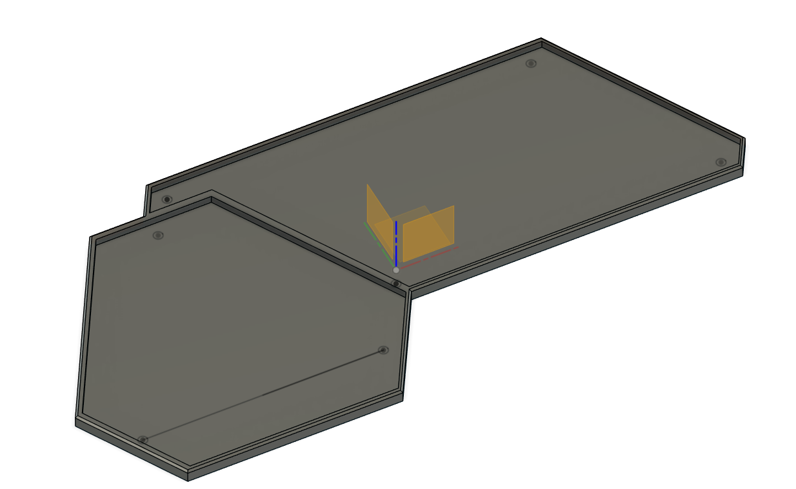

# Connecting Base

- **File:** [`connecting-base.f3d`](connecting-base.f3d)
- **Quantity:** 1
- **Status:** Designed, printed, fit verified, and integrated

## Purpose

The Connecting Base mechanically joins the pentagonal Weather Station Body footprint to the rectangular Power Module footprint. It establishes the intended relative position of the two main assemblies and forms the complete station structure shown in the physical prototype.

## Installation

- Orient the pentagonal end under the Weather Station Body.
- Orient the long rectangular end under the Power Module Assembly.
- Seat both assemblies in their matching footprints so the Power Module extends horizontally from the station body.
- Check the connecting cable path before final seating so wiring is not trapped between either enclosure and the base.

No screw, clip, or adhesive specification was supplied, so no attachment hardware is prescribed here.

## Printing

- Model material: PLA
- Profile: normal/default PLA printing profile
- Supports: enabled
- Support material: standard support configuration from the default PLA setup

No numeric slicer settings or support-interface configuration have been supplied.

The photograph verifies the printed fit and integration of both major assemblies. It does not establish outdoor or weather certification.
