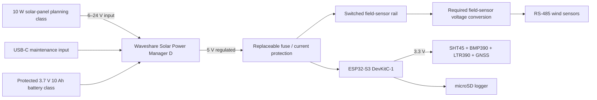

# v0.2 Power Tree

**Evidence level:** design baseline plus synthetic budget; no physical verification.

## Controls still required

| Item | v0.2 design rule | Real evidence needed |
|---|---|---|
| Battery | protected reputable pack; restraint; no public access | exact model, datasheet, inspection and temperature/current evidence |
| Fuse/protection | locate near source; rate after peak-current measurement | schematic, part number and fault test |
| Field rail | high-side switching; default off at boot/fault | warm-up and inrush measurement; recovery test |
| Voltage conversion | match exact wind-sensor supply requirement | converter efficiency and thermal test |
| Ground/RS-485 | document common-mode, shield, surge, bias and termination strategy | bench and cable-length evidence |
| Solar | removable connector, polarity protection, strain relief | site irradiance/charge log and weather-safe integration |

Do not connect an unreviewed lithium battery, panel or outdoor cable assembly from this diagram alone.

